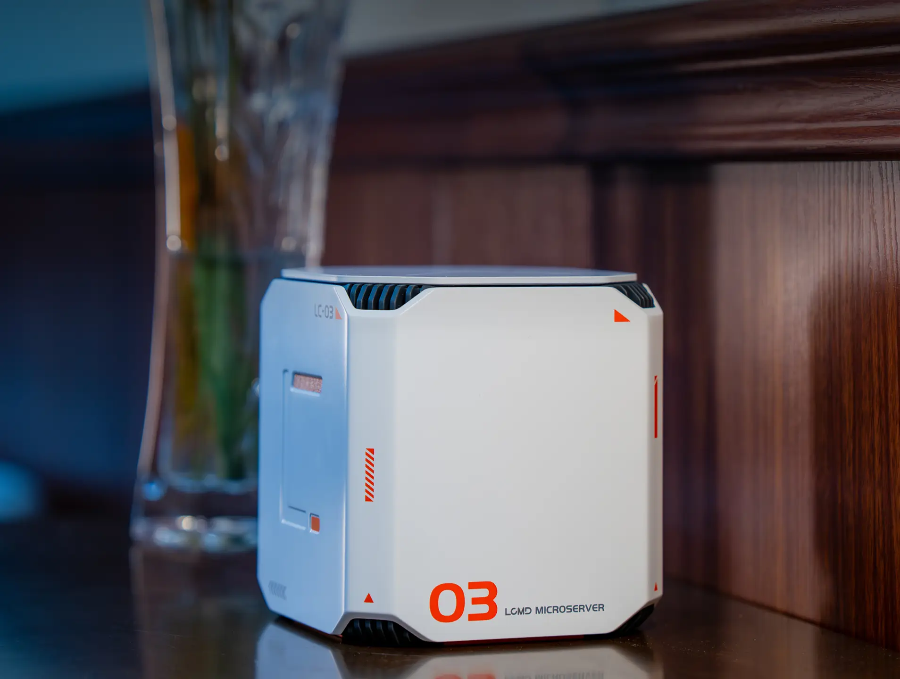

# Awesome LazyCat Microserver（中文）

[English](./README.md) | [中文](./README-ZH.md)

家庭私有云一体机，具备 NAS、应用商店、远程访问与本地 AI 算力能力。欢迎 [Star](https://github.com/mxuexxmy/awesome-lazycat-microserver)、[PR](./CONTRIBUTING.md) 或 [提交链接 Issue](https://github.com/mxuexxmy/awesome-lazycat-microserver/issues/new/choose)。

[懒猫微服](https://lazycat.cloud/)是新一代家庭私有云与 AI 数据中心，集 NAS、应用商店、内网穿透与 AI 算力于一体。

* [懒猫微服 LC-03](https://lazycat.cloud/lcmd)：7 盘位全固态，高性能标压处理器，最高支持 96TB 存储

* [懒猫 AI 算力舱](https://lazycat.cloud/ai-pod)：当前主推 LC-X5（2070T 算力、128GB 统一内存，支持约 284B 大模型）；另有 LC-X3 等型号，详见算力舱手册

* [懒猫摄像头](https://lazycat.cloud/camera)：潮玩外观，私有存储

* [懒猫微服操作系统](https://lazycat.cloud/)：基于 Debian 的三层架构，稳定安全

* [懒猫应用商店](https://appstore.lazycat.cloud/#/shop)：超 3000 款应用一键安装

* [懒猫 AI 浏览器](https://lazycat.cloud/)：基于 Chromium，支持 AI 插件，手机端可安装 Chrome 扩展

* 自带内网穿透、随处访问、不折腾

## 目录

* [官方资源/社区](#官方资源社区)
* [社区教程](#社区教程)
* [懒猫 AI 算力舱](#懒猫-ai-算力舱)
* [Skill / MCP / AI Agent](#skill--mcp--ai-agent)
* [LightOS](#lightos)
* [开发](#开发)
* [快速移植工具](#快速移植工具)
* [其他开发工具](#其他开发工具)
* [应用仓库](#应用仓库)
* [开发者模式](#开发者模式)
* [推荐应用](#推荐应用)
* [用户使用体验](#用户使用体验)
* [其他](#其他)
* [贡献](#贡献)

# 官方资源/社区

1. [懒猫微服官网](https://lazycat.cloud/)

2. [懒猫微服产品页](https://lazycat.cloud/lcmd)

3. [应用商店](https://appstore.lazycat.cloud/#/shop)

4. [使用攻略 Playground](https://playground.lazycat.cloud/#/home?dynamic=latest)

5. [懒猫微服开发者手册](https://developer.lazycat.cloud/)

6. [开发者中心](https://developer.lazycat.cloud/manage/)

7. [算力舱手册](https://developer.lazycat.cloud/aipod/)

8. [客户端下载](https://lazycat.cloud/download)

9. [AI 助手](https://lazycat.cloud/chat)

10. [懒猫摄像头](https://lazycat.cloud/camera)

11. [关于懒猫](https://lazycat.cloud/about)

12. [懒猫微服社区论坛](https://bbs.lazycat.cloud/)

13. [系统变更日志](https://developer.lazycat.cloud/changelog.html)

14. [社区激励规则](https://developer.lazycat.cloud/store-rule.html)

15. [开发者购机优惠](https://developer.lazycat.cloud/developer-cyber-discount.html)

16. [入门路线](https://developer.lazycat.cloud/getting-started/)

17. [懒猫微服开发者文档仓库](https://gitee.com/lazycatcloud/lzc-developer-doc)

18. [懒猫微服开发者手册（英文）](https://developer.lazycat.cloud/en/)

19. [创始人博客](https://manateelazycat.github.io/)

# 社区教程

1. [懒猫微服专栏](https://lazycat-docs.netlify.app/) — 80+ 篇实战文章，涵盖入门、进阶、开发与容器知识

2. [镜湖 · 忘机山人](https://blog.no-claw.com/) — 进阶心得系列（镜像仓库、Docker 引擎等）

3. [懒猫微服 — 一款独特的 NAS，使用体验分享（少数派）](https://sspai.com/post/103942)

4. [如何将已有 Docker Compose 应用移植到懒猫微服](https://lazycat.cloud/playground/guideline/662)

5. [商店 App 如何接管 Docker 引擎](https://blog.no-claw.com/e8e61ce7/)

6. [「懒猫微服」每个独立开发者或者初创团队都值得拥有](https://liaobinbin.com/posts/everyone-needs-lazycat-microserver/)

# 懒猫 AI 算力舱

1. [懒猫 AI 算力舱产品页](https://lazycat.cloud/ai-pod) — 当前主推 LC-X5（2070T / 128GB / ~284B）

2. [算力舱开发者手册](https://developer.lazycat.cloud/aipod/)

3. [LC-X5 配置（lzc-thor）](https://developer.lazycat.cloud/aipod/lc-x5/config.html)

4. [Ollama API](https://developer.lazycat.cloud/aipod/ollama/app-use-ollama-api.html)

5. [vLLM](https://developer.lazycat.cloud/aipod/vllm/)

6. [ComfyUI 常见问题](https://developer.lazycat.cloud/aipod/comfyui/)

7. [世界上第一台私人 AI 超算发布啦！](https://manateelazycat.github.io/2025/09/20/microserver-and-ai-pod/)

# Skill / MCP / AI Agent

1. [Skill / MCP 规范 | 开发者手册](https://developer.lazycat.cloud/resource-skill-mcp.html)

2. [打通网盘右键、MCP、SKILL 攻略](https://lazycat.cloud/playground/guideline/1628)

3. [llama-dash 使用攻略](https://lazycat.cloud/playground/guideline/1580) — 本地 LLM 网关与运维面板

4. [lazycat-mcp](https://github.com/lazycat-contrib/lazycat-mcp) — 连接懒猫硬件与大模型的 MCP 服务

5. [lazycat-skills](https://github.com/whoamihappyhacking/lazycat-skills) — 面向 Cursor / Claude 等的懒猫开发 Agent Skills（`npx skills add whoamihappyhacking/lazycat-skills`）

# LightOS

LightOS 是懒猫微服上的轻量级系统化运行环境，与 LPK 应用封装互补：LPK 适合封装独立应用能力（前端、后端、路由、应用级数据），LightOS 更适合需要长期管理完整运行环境的场景。

1. [LightOS 场景说明 | 开发者手册](https://developer.lazycat.cloud/advanced-lightos.html)

2. [LightOS 入口 | 应用商店](https://appstore.lazycat.cloud/#/shop/detail/cloud.lazycat.lightos.entry)

3. [LightOS 使用指南 | Playground](https://playground.lazycat.cloud/#/guideline/1537)

# 开发

1. [懒猫微服开发者手册](https://developer.lazycat.cloud/)

2. [入门路线](https://developer.lazycat.cloud/getting-started/)

3. [5 分钟完成 Hello World 并多端验证](https://developer.lazycat.cloud/getting-started/hello-world-fast.html)

4. [懒猫微服开发简明教程](https://czyt.tech/post/simple-guide-for-developing-for-lazycat-nas/)

5. [@lazycatcloud/lzc-cli](https://www.npmjs.com/package/@lazycatcloud/lzc-cli) — 官方 CLI，用于创建、构建、部署与发布 LPK 应用

6. [开发者环境搭建](https://developer.lazycat.cloud/getting-started/env-setup.html)

7. [Hello World](https://developer.lazycat.cloud/hello-world.html)

8. [发布自己的第一个应用](https://developer.lazycat.cloud/publish-app.html)

9. [lzc-build.yml 规范文档](https://developer.lazycat.cloud/spec/build.html)

10. [LPK 工作原理](https://developer.lazycat.cloud/getting-started/lpk-how-it-works.html)

11. [算力舱手册](https://developer.lazycat.cloud/aipod/)

12. [@lazycatcloud/sdk](https://www.npmjs.com/package/@lazycatcloud/sdk) — 官方 SDK，用于与微服系统状态交互

13. [应用商店发布指南](https://developer.lazycat.cloud/store-submission-guide.html)

14. [AI 应用打包规范](https://developer.lazycat.cloud/aipod/package/spec.html)

15. [LightOS 场景说明](https://developer.lazycat.cloud/advanced-lightos.html) — 系统化运行环境，与 LPK 互补

16. [Skill / MCP 规范](https://developer.lazycat.cloud/resource-skill-mcp.html)

# 快速移植工具

1. [lzc-dtl](https://github.com/jn7163/lzc-dtl) — Docker Compose 转懒猫微服应用（`npm i -g lzc-dtl`）

# 其他开发工具

1. [懒猫微服UID模拟器](https://github.com/glzjin/lzc-uid-impersonation)

2. [lazycat-mcp](https://github.com/lazycat-contrib/lazycat-mcp) — 连接大模型的 MCP 服务

3. [apps-scheduler](https://github.com/lazycat-contrib/apps-scheduler) — 应用定时调度工具

4. [lazycat-skills](https://github.com/whoamihappyhacking/lazycat-skills) — AI 编程助手技能包

# 应用仓库

1. [懒猫微服官方移植应用仓库](https://gitee.com/lazycatcloud/appdb)

2. [懒猫微服相关app应用贡献（非官方）](https://github.com/lazycat-contrib)

# 开发者模式

1. [KVM 模式 | 懒猫微服开发者手册](https://developer.lazycat.cloud/kvm.html)

2. [Dockerd 开发模式 | 懒猫微服开发者手册](https://developer.lazycat.cloud/dockerd-support.html)

3. [PVE](https://appstore.lazycat.cloud/#/shop/detail/in.zhaoj.webvirtcloud)

4. [开发流程总览（lzcapp / 开发态）](https://developer.lazycat.cloud/getting-started/dev-workflow.html)

5. [LightOS | 懒猫微服开发者手册](https://developer.lazycat.cloud/advanced-lightos.html)

# 推荐应用

## 官方应用

1. [通讯录](https://lazycat.cloud/appstore/#/shop/detail/cloud.lazycat.app.contacts)

通讯录是一款能备份、恢复、同步手机通讯录的软件，支持批量导入和导出联系人，保护信息安全，提高办公效率。

2. [懒猫应用生成器](https://lazycat.cloud/appstore/#/shop/detail/cloud.lazycat.app.create)

3. [下载器](https://lazycat.cloud/appstore/#/shop/detail/cloud.lazycat.app.downloader)

下载器是懒猫云平台提供的一款下载工具。可以通过URL地址或者特定的关键词搜索下载目标文件，并将其下载到本地电脑或移动设备中。下载器可以下载各种类型的文件，包括音频、视频、文档、图片等等。同时，下载器还可以支持多线程下载，提高下载速度，还可以暂停、恢复、删除和管理下载任务。

4. [局域网端口转发工具](https://lazycat.cloud/appstore/#/shop/detail/cloud.lazycat.app.forward)

用于映射微服中其他容器与应用的端口至局域网端口

5. [懒猫实验Ollama](https://lazycat.cloud/appstore/#/shop/detail/cloud.lazycat.app.lzcollama)

6. [懒猫智慧屏](https://lazycat.cloud/appstore/#/shop/detail/cloud.lazycat.app.lzctvcontroller)

懒猫智慧屏是一款集音乐、影视、游戏、智能控制等多功能于一体的智慧软件，它融合了智能电视多功能显示，支持懒猫微服生态的众多应用，为用户提供更加智能化和交互性更强的家庭生活体验。

7. [文字识别](https://lazycat.cloud/appstore/#/shop/detail/cloud.lazycat.app.ocr)

文字识别是懒猫云平台提供的一款文字识别工具。可以将图片或扫描文档中的文字转换为可编辑、可搜索的文本，可以快速地将纸质文档转换为电子文档，提高文档的利用价值和管理效率。

8. [懒猫相册](https://lazycat.cloud/appstore/#/shop/detail/cloud.lazycat.app.photo)

懒猫相册是懒猫云平台提供的一款图片管理工具。用户可以将个人或家庭的照片上传至云端，通过网络访问和分享。用户可以通过相册管理照片，包括编辑、删除、分类、搜索等功能，还可以创建相册、设置相册权限、邀请好友共享等。

9. [观影助手](https://lazycat.cloud/appstore/#/shop/detail/cloud.lazycat.app.re)

浏览器是懒猫云平台提供的一款浏览器。更快的浏览体验，更安全的浏览保护，支持地址栏、书签、历史记录、下载管理器等功能，也可投屏到播放器中使用；

10. [内测工具](https://lazycat.cloud/appstore/#/shop/detail/cloud.lazycat.app.testflight)

灰度测试

11. [懒猫清单](https://lazycat.cloud/appstore/#/shop/detail/cloud.lazycat.app.todolist)

懒猫清单是一款简单有效的待办事项和任务管理应用。

12. [视频播放器](https://lazycat.cloud/appstore/#/shop/detail/cloud.lazycat.app.video)

播放器是懒猫云平台提供的一款视频播放工具。支持音频、视频等多种格式的媒体文件，为用户打造强大的视频播放器。

13. [懒猫开发者工具](https://lazycat.cloud/appstore/#/shop/detail/cloud.lazycat.developer.tools)

14. [懒猫网盘](https://lazycat.cloud/appstore/#/shop/detail/cloud.lazycat.shell.files)

懒猫网盘是懒猫云平台提供的一款文件管理工具。用户可以将自己的文件上传到云网盘中进行备份和共享，释放本地空间，并可以随时随地通过互联网访问自己的文件。

## AI 应用

1. [懒猫实验 Ollama](https://lazycat.cloud/appstore/#/shop/detail/cloud.lazycat.app.lzcollama) — 本地大模型推理

2. [llama-dash 使用攻略](https://lazycat.cloud/playground/guideline/1580) — 本地 LLM 网关、API Key 与 Playground

3. [Ollama API（算力舱）](https://developer.lazycat.cloud/aipod/ollama/app-use-ollama-api.html) — 通过算力舱调用 Ollama / OpenAI 兼容接口

4. [vLLM（算力舱）](https://developer.lazycat.cloud/aipod/vllm/) — 高性能推理与分布式推理

5. [ComfyUI（算力舱）](https://developer.lazycat.cloud/aipod/comfyui/) — 文生图等工作流

6. [Skill / MCP 规范](https://developer.lazycat.cloud/resource-skill-mcp.html) — 让 Agent 接入微服技能与工具

## 影音娱乐

1. [Jellyfin](https://lazycat.cloud/appstore/#/shop/detail/cloud.lazycat.app.jellyfin)

开源家庭影音中心，支持转码、多设备远程观看与 4K 播放。

2. [Emby](https://lazycat.cloud/appstore/#/shop/detail/cloud.lazycat.app.emby)

功能丰富的媒体服务器，适合搭建家庭影院库。

3. [Navidrome](https://lazycat.cloud/appstore/#/shop/detail/cloud.lazycat.app.navidrome)

轻量级音乐服务器，支持 Subsonic API 与多平台客户端流媒体播放。

4. [MoviePilot](https://lazycat.cloud/appstore/#/shop/detail/cloud.lazycat.app.moviepilot)

影视自动化管理工具，支持订阅、搜索与媒体库整理。

5. [qBittorrent Enhanced](https://lazycat.cloud/appstore/#/shop/detail/cloud.lazycat.app.qbittorrentee)

增强版 BT/PT 下载客户端，适合影视资源采集。

6. [Stremio](https://lazycat.cloud/appstore/#/shop/detail/cloud.lazycat.app.stremio)

跨平台流媒体聚合播放器，支持插件扩展。

## 效率工具

1. [Vaultwarden](https://lazycat.cloud/appstore/#/shop/detail/community.lazycat.app.vaultwarden)

自托管密码管理器，兼容 Bitwarden 客户端，数据完全私有。

2. [Syncthing](https://lazycat.cloud/appstore/#/shop/detail/cloud.lazycat.app.syncthing)

去中心化文件同步工具，支持多设备实时同步。

3. [Tailscale](https://lazycat.cloud/appstore/#/shop/detail/cloud.lazycat.app.tailscale)

基于 WireGuard 的虚拟组网工具，轻松实现设备互联。

4. [Memos](https://lazycat.cloud/appstore/#/shop/detail/cloud.lazycat.app.memos)

轻量级备忘录与知识记录工具，支持标签与分享。

5. [EZ Bookkeeping](https://lazycat.cloud/appstore/#/shop/detail/cloud.lazycat.app.ezbookkeeping)

简洁的个人记账应用，适合日常收支管理。

## 生活

1. [Home Assistant](https://lazycat.cloud/appstore/#/shop/detail/cloud.lazycat.app.homeassistant)

开源智能家居平台，支持数千种设备接入与自动化场景。

2. [Immich](https://lazycat.cloud/appstore/#/shop/detail/cloud.lazycat.app.immich)

高性能照片备份与管理工具，支持 AI 人脸识别与移动端自动备份。

3. [Lucky](https://lazycat.cloud/appstore/#/shop/detail/cloud.lazycat.app.lucky)

软硬路由公网神器，支持端口转发、DDNS 与内网穿透。

## 图形设计

1. [Draw.io](https://lazycat.cloud/appstore/#/shop/detail/cloud.lazycat.app.drawio)

在线流程图与架构图绘制工具，支持多种图表类型。

2. [Excalidraw](https://lazycat.cloud/appstore/#/shop/detail/cloud.lazycat.app.excalidraw)

手绘风格白板工具，适合快速草图与协作绘图。

## 阅读学习

1. [Calibre](https://lazycat.cloud/appstore/#/shop/detail/cloud.lazycat.app.calibre)

强大的电子书管理与阅读工具，支持格式转换与书库整理。

2. [思源笔记](https://lazycat.cloud/appstore/#/shop/detail/community.lazycat.app.siyuan-note)

本地优先的块级笔记应用，支持双向链接与多端同步。

## 游戏

1. [Minecraft 服务器](https://lazycat.cloud/appstore/#/shop/detail/cloud.lazycat.app.minecraftserver)

一键部署 Minecraft 游戏服务器，支持好友联机。

## 开发工具

1. [Coder](https://lazycat.cloud/appstore/#/shop/detail/community.lazycat.app.coder)

基于浏览器的远程开发环境，代码直接保存在微服上。

2. [Forgejo](https://lazycat.cloud/appstore/#/shop/detail/cloud.lazycat.app.forgejo)

轻量级 Git 代码托管平台，Forgejo 是 Gitea 的社区分支。

3. [GitLab](https://lazycat.cloud/appstore/#/shop/detail/cloud.lazycat.app.gitlab)

功能完整的 DevOps 平台，支持 CI/CD、代码审查与项目管理。

## 其他

1. [AList](https://lazycat.cloud/appstore/#/shop/detail/cloud.lazycat.app.alist)

多网盘聚合挂载工具，支持阿里云盘、百度网盘等主流网盘。

2. [Jellyseerr](https://lazycat.cloud/appstore/#/shop/detail/cloud.lazycat.app.jellyseerr)

影视请求管理工具，与 Jellyfin/Plex 配合使用。

3. [Sonarr](https://lazycat.cloud/appstore/#/shop/detail/cloud.lazycat.app.sonarr)

电视剧自动下载与媒体库管理工具。

4. [Radarr](https://lazycat.cloud/appstore/#/shop/detail/cloud.lazycat.app.radarr)

电影自动下载与媒体库管理工具。

# 用户使用体验

1. [懒猫微服：小巧身材，大大满足——从颜值到功能的全方位体验](https://www.zhaoj.in/read-8958.html)

2. [懒猫微服体验——自由协作的神器](https://blog.kevinzhow.com/posts/lazycat/zh)

3. [懒猫微服的非典型性玩法](https://ironfeet.me/unconventional-usage-of-lazycat-microserver/)

4. [折腾无上限，快乐无极限 - 我的懒猫微服记](https://mp.weixin.qq.com/s/Sp6Xme0ulNFgPtXstLnANg)

5. [开箱测评 AI 服务器：懒猫微服 LC - 02](https://mp.weixin.qq.com/s/_s2zz1axhUfBeXXc0UqlxQ)

6. [这只懒猫有点毒1](https://lorddoomed.notion.site/1-16000d63a5ed809db153dcec0abfff7f)

7. [这只懒猫有点毒2](https://lorddoomed.notion.site/2-16000d63a5ed80eab00fceccb165ba3d)

8. [这只懒猫有点毒3](https://lorddoomed.notion.site/3-16000d63a5ed8013998fde1f1499cf2c)

9. [家庭黑科技！超越NAS的神器｜懒猫微服](https://www.xiaohongshu.com/explore/679841ec000000002900d24e?note_flow_source=wechat&xsec_token=CBbXKvDur-yvMCWTsfO2JPm6PUm2S-qT7DhEwfhnVyq5g=)

10. [我的第一台家庭服务器-懒猫微服体验报告](https://be1yu.notion.site/150c78753c2f80469051dc02dc4ffcd9)

11. [喜欢自娱自乐的我，找到了新的玩意 -- 懒猫微服](https://mp.weixin.qq.com/s/AsmRqfZEUrUOP0DrzXq7Gg)

12. [世界上第一台私人 AI 超算发布啦！](https://manateelazycat.github.io/2025/09/20/microserver-and-ai-pod/)

13. [懒猫微服对技术用户有什么用？](https://manateelazycat.github.io/2025/05/03/microserver-for-developer/)

14. [LCMD Microserver & AI Pod（英文评测）](https://the-diy-life.com/lcmd-microserver-ai-pod-a-compact-homelab-powerhouse/)

15. [分享新买的设备 -- 懒猫微服（V2EX）](https://www.v2ex.com/t/1111706)

16. [送懒猫微服！极速内网穿透 + LightOS Vibe Coding（V2EX）](https://www.v2ex.com/t/1204968)

# 其他

[懒猫微服的前世今生](https://manateelazycat.github.io/2024/08/20/why-microserver/)

> 懒猫微服老板介绍懒猫微服的由来

# 贡献

欢迎补充链接、修正失效地址，或同步中英文内容。请先阅读 [贡献指南](./CONTRIBUTING.md)。
